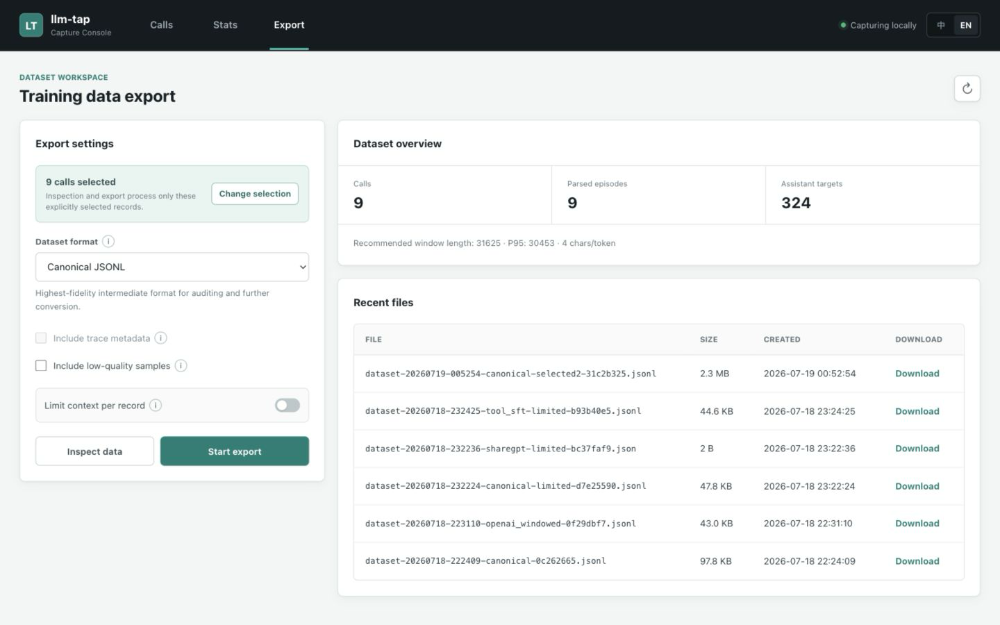

# llm-tap

[English](README.md) | [中文](README_zh.md)

**A local transparent proxy that captures real LLM conversations, then lets you filter, inspect, and export training datasets.**

Change the client's LLM request URL from `https://api.xxx.com` to `http://127.0.0.1:12345/api.xxx.com`, and the proxy transparently forwards requests/responses while saving each complete call as-is for downstream training data construction.

## Start Here

| Goal | Where to go |
|------|-------------|
| Run the proxy and connect a client | [Quick Start](#quick-start) and [Client Configuration Examples](#client-configuration-examples) |
| Browse captured calls | [Web UI](#web-ui) |
| Export training data from selected calls | [Harness Dataset Export](#harness-dataset-export) |
| Understand formats, filtering, and context limits | [Dataset Export Design](docs/dataset-export.md) |

The normal workflow is: **start the proxy -> point the client at the proxy -> use the client normally -> select calls in the Web UI -> inspect and export**. Raw captures stay in the active data directory; generated datasets are separate export files.

## Community

- [Discuss llm-tap on LINUX DO](https://linux.do/t/topic/2614142)

## How It Works

```
Client (Claude Code / Codex / CherryStudio / any OpenAI-compatible app)
  │
  │  URL: http://127.0.0.1:12345/api.xxx.com/v1/chat/completions
  │  Key: real upstream API key (unchanged)
  │
  ▼
┌─────────────────────────────────────────┐
│         Transparent Proxy Server        │
│                                         │
│  1. Extract host from path: api.xxx.com │
│  2. Rebuild URL: https://api.xxx.com/...│
│  3. Forward auth headers as-is          │
│  4. Detect protocol (chat/messages/...) │
│  5. Stream + merge into full response   │
│  6. Save complete call to JSON file     │
└─────────────────────────────────────────┘
  │
  ▼
Real LLM provider (SiliconFlow / DeepSeek / Zhipu / Anthropic / OpenAI / any)
```

## Features

- **Zero upstream config** — host from path, key from headers, proxy holds no credentials
- **Auto protocol detection** — from path suffix (`/v1/chat/completions` / `/v1/messages` / `/v1/responses`)
- **Multi-provider support** — configure multiple providers in client, each with its own URL
- **Stream merging** — merge SSE chunks into a complete response JSON (equivalent to non-streaming)
- **Faithful storage** — one JSON file per call with request + response + metadata, no protocol conversion
- **Organized by host** — data naturally categorized by provider

## Quick Start

### 1. Get the app

**Option A — Prebuilt binary (recommended)**

Download the latest release for your platform from the [Releases page](https://github.com/luckfu/llm-tap/releases):

| Asset | Platform |
|-------|----------|
| `llm-tap-macos-arm64.tar.gz` | macOS Apple Silicon |
| `llm-tap-macos-x86_64.tar.gz` | macOS Intel |
| `llm-tap-windows-x86_64.zip` | Windows x64 |

Unzip and launch. macOS: the `.app` is unsigned, so unblock it once with `xattr -cr /path/to/llm-tap.app`. Windows: if SmartScreen warns, choose "More info → Run anyway".

The tray app starts the proxy on port `12345` by default. Open the Web UI from the tray menu, or change the port and data directory via **Settings...**.

**Option B — Run from source**

```bash
pip install -r requirements-app.txt
python3 proxy_oneapi.py -p 12345
```

### 2. Configure client

Change the client's API URL from:
```
https://api.xxx.com/v1
```
to:
```
http://127.0.0.1:12345/api.xxx.com/v1
```

API key stays the same — use the real upstream key.

### 3. Use normally

The client works as usual. The proxy collects data in the background.

## Client Configuration Examples

### Claude Code (Anthropic protocol)

```bash
export ANTHROPIC_BASE_URL=http://127.0.0.1:12345/api.anthropic.com
export ANTHROPIC_API_KEY=sk-ant-your-real-key
claude
```

Using Zhipu's Anthropic-compatible endpoint:
```bash
export ANTHROPIC_BASE_URL=http://127.0.0.1:12345/open.bigmodel.cn/api/anthropic
export ANTHROPIC_API_KEY=your-zhipu-key
claude
```

### Codex CLI (OpenAI Responses protocol)

`~/.codex/config.toml`:
```toml
[model_providers.OpenAI]
name = "OpenAI"
base_url = "http://127.0.0.1:12345/api.openai.com/v1"
wire_api = "responses"
requires_openai_auth = true
```

### CherryStudio / any OpenAI-compatible client

```
API URL: http://127.0.0.1:12345/api.siliconflow.cn/v1
API Key: your real key
```

### Multi-provider scenario (hermes / openclaw etc.)

Each provider gets its own URL:
```
Provider 1: http://127.0.0.1:12345/open.bigmodel.cn/api/coding/paas/v4
Provider 2: http://127.0.0.1:12345/api.openai.com/v1
Provider 3: http://127.0.0.1:12345/api.deepseek.com/v1
```

Zero proxy config — routing is automatic by host.

## Data Storage

### Directory layout

```
data/calls/
├── api.anthropic.com/
│   └── 2026/07/01/
│       └── call-20260701120000-abc123.json
├── open.bigmodel.cn/
│   └── 2026/07/01/
│       └── call-20260701130000-def456.json
└── api.openai.com/
    └── 2026/07/01/
        └── call-20260701140000-ghi789.json
```

Organized by host + date. Each file is one complete call.

### Single-call file

```json
{
  "meta": {
    "call_id": "call-20260701120000-abc123",
    "protocol": "anthropic-messages",
    "upstream_provider": "api.anthropic.com",
    "upstream_model": "claude-sonnet-4-20250514",
    "started_at": "2026-07-01T12:00:00",
    "finished_at": "2026-07-01T12:00:05",
    "duration_ms": 5343,
    "first_token_ms": 4672,
    "upstream_status": 200,
    "stop_reason": "end_turn",
    "is_stream": true
  },
  "request": { ... },    // raw request body (protocol-native)
  "response": { ... },   // merged full response (equivalent to non-streaming)
  "headers": { ... }     // sanitized headers
}
```

**Request and response are in the same file.** No protocol conversion — each protocol's native structure is preserved.

If the upstream returns HTTP 200 but the JSON body itself is a provider-level error, such as `{"code":500,"msg":"404 NOT_FOUND","success":false}`, a top-level `error`, an Anthropic streaming `type=error` event, or Responses `status=failed/incomplete`, the proxy still relays it to the client but does not save it as training data.

### Protocol Fidelity

| Protocol | Path Suffix | Response Structure |
|----------|-------------|---------------------|
| OpenAI Chat | `/v1/chat/completions` | `{choices:[{message, finish_reason}], usage}` |
| Anthropic Messages | `/v1/messages` | `{content:[...], stop_reason, usage}` |
| OpenAI Responses | `/v1/responses` | `{output:[...], status, usage}` |

Anthropic's `thinking` block (with `signature`), `tool_use` block, `tool_result` block — all preserved as-is.

## Harness Dataset Export

`export_harness_dataset.py` converts raw calls into a provider-neutral agent harness trajectory JSONL format. The canonical format preserves messages, tool calls, tool results, reasoning, harness metadata, and raw protocol fragments so it can later be compiled to OpenAI, ShareGPT, ChatML, TRL, LLaMA-Factory, or other training formats.

For the full export design, processing rules, sliding-window strategy, and parameter reference, see [Dataset Export Design](docs/dataset-export.md).

### Choose an output format

| Format | Choose it when |
|--------|----------------|
| `canonical` | You want the most complete provider-neutral intermediate data for later conversion or auditing. |
| `openai` | Your training loader expects one OpenAI-style `{"messages": [...]}` object per JSONL line. |
| `tool_sft` | Your training framework understands structured tool calls and `role=tool` messages. |
| `sharegpt` | Your training loader expects a ShareGPT JSON array and text-based tool tags. |
| `openai_windowed` | Long trajectories need multiple assistant-targeted samples under a sequence budget. |

For a first export, inspect the data, select records in the Web UI, and use `openai` or `tool_sft` unless your training framework requires another format. Use `--context-limit` when each exported sample must fit a per-record budget.

Inspect exportable data:

```bash
python export_harness_dataset.py inspect --preview 3
```

Export canonical JSONL:

```bash
python export_harness_dataset.py export --out data/harness.jsonl
```

Export ShareGPT JSON:

```bash
python export_harness_dataset.py export --format sharegpt --out data/sharegpt.json
```

ShareGPT output includes only `id` and `conversations` by default. When an episode has tools, the exporter injects tool definitions as a `system` turn wrapped in `<tools>...</tools>`, and preserves tool trajectories with `<tool_call>` / `<tool_result>` blocks. Use `--no-tools` to disable tool definition injection. Add `--include-metadata` only for debugging or traceability.

Export structured tool-call SFT JSONL, recommended for training frameworks that support tool/function calling:

```bash
python export_harness_dataset.py export --format tool_sft --out data/tool_sft.jsonl
```

Each `tool_sft` line has top-level `tools` and `messages`; `messages` preserves `assistant.tool_calls`, `role=tool`, `tool_call_id`, and `assistant.reasoning_content` when available.

Export OpenAI Chat Completions fine-tuning JSONL:

```bash
python export_harness_dataset.py export --format openai --out data/openai_finetune.jsonl
```

Each `openai` line is a `{"messages":[...]}` object. The exporter maps `developer` to `system`, merges standalone Responses `reasoning` into the next `assistant.content` as `<think>...</think>`, combines adjacent tool calls into one `assistant.tool_calls` array, and always serializes `function.arguments` as a JSON string.

Export OpenAI sliding-window fine-tuning JSONL, experimental and budgeted at 4096 estimated tokens by default:

```bash
python export_harness_dataset.py export --format openai_windowed --max-seq-len 4096 --out data/openai_windowed.jsonl
```

`openai_windowed` splits a long trajectory into multiple examples. Each example targets one `assistant` message, while preserving a fixed prefix and as much recent history as fits. Because the exporter does not know the final training model's tokenizer, the window budget uses a heuristic `JSON characters / --chars-per-token` estimate by default; `--chars-per-token` defaults to `4.0`. If the system prompt is too long, the exporter compacts the `system` prefix according to `--prefix-budget-ratio` so recent history and the target assistant message still have budget.

By default, the exporter reads the desktop app database at `~/.llm-tap/calls.db`. To inspect the development database in the current directory:

```bash
python export_harness_dataset.py --db calls.db inspect
```

### Export Options

Global options:

| Option | Default | Description |
|--------|---------|-------------|
| `--db PATH` | `~/.llm-tap/calls.db` | Database to read calls from. The desktop app writes to `~/.llm-tap/calls.db` by default; use `--db calls.db` for a local development database. |

`inspect` options:

| Option | Default | Description |
|--------|---------|-------------|
| `--preview N` | `3` | Print N episode previews for a quick check of messages, tools, and model distribution. |
| `--limit N` | unlimited | Read only the first N calls. Put it after `inspect`, for example `inspect --limit 100`. |
| `--window-budget` | off | Estimate the minimum `--max-seq-len` needed by `openai_windowed` to keep the full fixed prefix plus at least one assistant target turn. |
| `--chars-per-token N` | `4.0` | Used with `--window-budget`; heuristic character/token divisor when no tokenizer is available. |

`export` options:

| Option | Default | Description |
|--------|---------|-------------|
| `--out PATH` | required | Output file path. Prefer writing under `data/`, for example `data/openai_finetune.jsonl`. |
| `--format FORMAT` | `canonical` | Export format. Choices: `canonical`, `sharegpt`, `tool_sft`, `openai`, `openai_windowed`. |
| `--limit N` | unlimited | Export only the first N calls. Put it after `export`, for example `export --limit 100`. |
| `--include-skipped` | off | By default, low-quality examples such as calls without assistant output are skipped; enable this to write them anyway. |
| `--include-metadata` | off | Adds source, model, harness, labels, and stats in supported formats. Useful for debugging and traceability; usually unnecessary for training. |
| `--no-tools` | off | Applies only to `sharegpt`. Disables `<tools>...</tools>` tool definition injection while preserving tool call/result text trajectories. |
| `--context-limit` | off | Enable per-record context limits for canonical, sharegpt, tool_sft, or openai. |
| `--max-seq-len N` | `4096` | Applies to `--context-limit` or `openai_windowed`. Maximum estimated length per record. |
| `--chars-per-token N` | `4.0` | Applies to context limits. Estimates tokens as `JSON characters / N`; smaller values are more conservative. |
| `--prefix-budget-ratio N` | `0.45` | Applies to context limits. Maximum fraction reserved for the fixed prefix, preventing long system prompts from crowding out history. |

Format summary:

| Format | Output type | Use case |
|--------|-------------|----------|
| `canonical` | JSONL | llm-tap's provider-neutral intermediate format with the most raw information preserved. |
| `sharegpt` | JSON array | ShareGPT-style conversation format; tool trajectories are serialized into XML-like text tags. |
| `tool_sft` | JSONL | For training frameworks that support structured tool calling; preserves top-level `tools` and message-level `tool_calls`. |
| `openai` | JSONL | OpenAI Chat Completions fine-tuning format. Each line is `{"messages":[...]}` for OpenAI-format-compatible data loaders. |
| `openai_windowed` | JSONL | Sliding-window long-trajectory examples in OpenAI format. Each line is still `{"messages":[...]}`, with the final assistant message as the current training target. |

## Project Structure

```
llm-tap/
├── proxy_oneapi.py        # Transparent proxy server
├── raw_storage.py         # Faithful call storage (+ event hook)
├── export_harness_dataset.py # Canonical harness trajectory exporter
├── stream_merger.py       # Stream response merging (OpenAI Chat / Anthropic Messages)
├── utils.py               # Async logging + database init
├── tray_app.py            # Menu-bar / system-tray app entry point
├── requirements-app.txt   # Dependencies for proxy + tray app
└── .github/workflows/     # Release build (mac x86_64 / arm64, windows x86_64)
```

## Launch Parameters

```bash
python3 proxy_oneapi.py -p 12345 --log-level INFO
```

| Parameter | Default | Description |
|-----------|---------|-------------|
| `-p, --port` | 12345 | Listen port |
| `--bind` | `127.0.0.1` | Listen address; may also be set as `bind` in `config.json` |
| `--log-level` | INFO | Log level (DEBUG/INFO/WARNING/ERROR) |

## Desktop App (Menu Bar / System Tray)

`tray_app.py` wraps the proxy in a menu-bar (macOS) / system-tray (Windows) app. It shows a teardrop icon — blue-teal when idle, **green with a soft glow and a red count badge** for ~2s whenever a call is captured. The tray menu lets you open the Web UI, change the listen port and data directory (persisted to `~/.llm-tap/settings.json`), and quit.

Run from source:

```bash
pip install -r requirements-app.txt
# macOS backend:
pip install pyobjc
# Windows backend:
pip install pywin32

python3 tray_app.py                 # default port 12345
LLM_TAP_PORT=9000 python3 tray_app.py
LLM_TAP_DATA_DIR=/path/to/llm-tap-data python3 tray_app.py
```

Prebuilt binaries are published via GitHub Actions on every `v*` tag — see **Quick Start** above for download links and launch notes. Data is stored under `~/.llm-tap/` by default when running as a desktop app, and can be changed from **Settings...**.

## Design Principles

1. **Stream merging = reconstruct equivalent non-streaming response** — preserve protocol-native structure, no cross-protocol conversion
2. **Failed calls not saved** — upstream non-200 only logged, not stored
3. **GET requests pass-through** — model list and other GET requests not saved
4. **Header sanitization** — `Authorization`, `x-api-key` etc. only retain length info

## Web UI

Visit `http://127.0.0.1:12345/` in a browser for the management interface. The main workflow is:

1. Filter calls by Host, Model, protocol, status, or local start/end time.
2. Select individual calls, the current page, or all calls matching the current filters. Selection persists across pages.
3. Open **Export**, inspect the selected records, and review the quality and context-budget summary.
4. Choose a format and export. The downloaded file contains only the selected call IDs.

The UI supports call details, statistics, English/Chinese labels, and the formats listed above. Inspection and export use the same immutable selection; the UI never silently falls back to a full-database export. Generated files are restricted to `data/exports/` under the active data directory and can be downloaded from the page.

Canonical, ShareGPT, tool SFT, and OpenAI exports support **Limit context per record**. When enabled, each sample targets one assistant message, keeps the fixed prefix and nearest complete history, preserves complete tool-call/result groups, and compacts oversized tool results or system prefixes to fit the budget. The legacy `openai_windowed` format remains available for compatibility. For long trajectories, inspect first and use the reported window budget to choose `max_seq_len`.

The proxy listens on `127.0.0.1` by default. Data browsing is protected separately from transparent forwarding; without `ui_tokens`, the Web UI and `/api/*` data endpoints are only available from local loopback.

To accept LAN or other non-loopback connections, both a dedicated proxy token and an upstream allowlist are required:

```json
{
  "bind": "0.0.0.0",
  "proxy_tokens": ["proxy-secret"],
  "upstream_allowlist": ["api.openai.com", "*.example.com"],
  "ui_tokens": ["change-me"],
  "upstream_conn_limit": 1000,
  "upstream_conn_limit_per_host": 0,
  "upstream_dns_cache_ttl": 300,
  "upstream_keepalive_timeout": 30,
  "save_queue_max": 1000,
  "save_batch_size": 20,
  "capture_max_bytes": 67108864,
  "stream_capture_max_bytes": 67108864,
  "request_max_bytes": 8000000,
  "pretty_json": false
}
```

Remote proxy requests must additionally send `X-LLM-Tap-Token: proxy-secret`. This header is never forwarded upstream, leaving `Authorization` or `x-api-key` available for the real provider credential. Then open `http://host:12345/?token=change-me` once to set the browser cookie. Web API clients can also send `Authorization: Bearer change-me`.

### Filter and select calls


### Call Detail


### Statistics Overview


### Export Selected Records



## FAQ

### curl reports `Failed to connect to 127.0.0.1 port 7890`

System HTTP proxy (Clash/V2Ray etc.) intercepts curl. Add `--noproxy '*'`:
```bash
curl --noproxy '*' http://127.0.0.1:12345/...
```

### Codex reports `stream disconnected before completion`

Codex may be using the system proxy. Set before launching:
```bash
export NO_PROXY=127.0.0.1,localhost
export no_proxy=127.0.0.1,localhost
```

### Port already in use

```bash
lsof -ti:12345 | xargs kill -9
```
