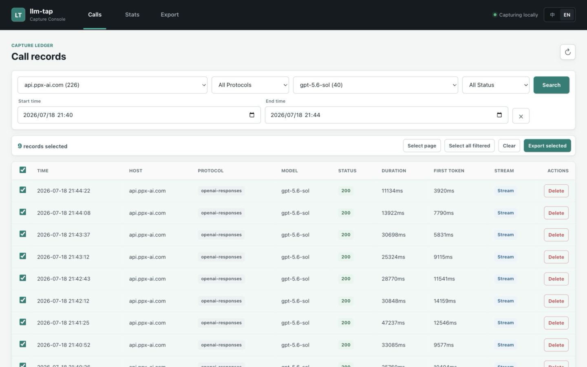
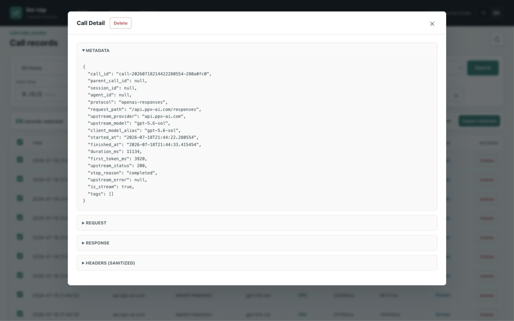
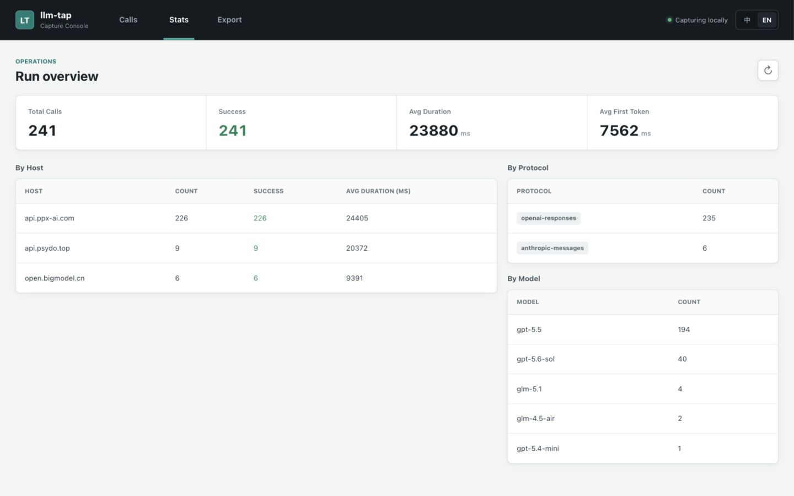

# llm-tap

[English](README.md) | [中文](README_zh.md)

LLM transparent proxy + data collection system.

Change the client's LLM request URL from `https://api.xxx.com` to `http://127.0.0.1:12345/api.xxx.com`, and the proxy transparently forwards requests/responses while saving each complete call as-is for downstream training data construction.

## How It Works

```
Client (Claude Code / Codex / CherryStudio / any OpenAI-compatible app)
  │
  │  URL: http://127.0.0.1:12345/api.xxx.com/v1/chat/completions
  │  Key: real upstream API key (unchanged)
  │
  ▼
┌─────────────────────────────────────────┐
│         Transparent Proxy Server        │
│                                         │
│  1. Extract host from path: api.xxx.com │
│  2. Rebuild URL: https://api.xxx.com/...│
│  3. Forward auth headers as-is          │
│  4. Detect protocol (chat/messages/...) │
│  5. Stream + merge into full response   │
│  6. Save complete call to JSON file     │
└─────────────────────────────────────────┘
  │
  ▼
Real LLM provider (SiliconFlow / DeepSeek / Zhipu / Anthropic / OpenAI / any)
```

## Features

- **Zero upstream config** — host from path, key from headers, proxy holds no credentials
- **Auto protocol detection** — from path suffix (`/v1/chat/completions` / `/v1/messages` / `/v1/responses`)
- **Multi-provider support** — configure multiple providers in client, each with its own URL
- **Stream merging** — merge SSE chunks into a complete response JSON (equivalent to non-streaming)
- **Faithful storage** — one JSON file per call with request + response + metadata, no protocol conversion
- **Organized by host** — data naturally categorized by provider

## Quick Start

### 1. Get the app

**Option A — Prebuilt binary (recommended)**

Download the latest release for your platform from the [Releases page](https://github.com/luckfu/llm-tap/releases):

| Asset | Platform |
|-------|----------|
| `llm-tap-macos-arm64.tar.gz` | macOS Apple Silicon (Intel Macs run via Rosetta 2) |
| `llm-tap-windows-x86_64.zip` | Windows x64 |

Unzip and launch. macOS: the `.app` is unsigned, so unblock it once with `xattr -cr /path/to/llm-tap.app`. Windows: if SmartScreen warns, choose "More info → Run anyway".

The tray app starts the proxy on port `12345` by default. Open the Web UI from the tray menu, or change the port via **Settings...**.

**Option B — Run from source**

```bash
pip install -r requirements.txt
python3 proxy_oneapi.py -p 12345
```

### 2. Configure client

Change the client's API URL from:
```
https://api.xxx.com/v1
```
to:
```
http://127.0.0.1:12345/api.xxx.com/v1
```

API key stays the same — use the real upstream key.

### 3. Use normally

The client works as usual. The proxy collects data in the background.

## Client Configuration Examples

### Claude Code (Anthropic protocol)

```bash
export ANTHROPIC_BASE_URL=http://127.0.0.1:12345/api.anthropic.com
export ANTHROPIC_API_KEY=sk-ant-your-real-key
claude
```

Using Zhipu's Anthropic-compatible endpoint:
```bash
export ANTHROPIC_BASE_URL=http://127.0.0.1:12345/open.bigmodel.cn/api/anthropic
export ANTHROPIC_API_KEY=your-zhipu-key
claude
```

### Codex CLI (OpenAI Responses protocol)

`~/.codex/config.toml`:
```toml
[model_providers.OpenAI]
name = "OpenAI"
base_url = "http://127.0.0.1:12345/api.openai.com/v1"
wire_api = "responses"
requires_openai_auth = true
```

### CherryStudio / any OpenAI-compatible client

```
API URL: http://127.0.0.1:12345/api.siliconflow.cn/v1
API Key: your real key
```

### Multi-provider scenario (hermes / openclaw etc.)

Each provider gets its own URL:
```
Provider 1: http://127.0.0.1:12345/open.bigmodel.cn/api/coding/paas/v4
Provider 2: http://127.0.0.1:12345/api.openai.com/v1
Provider 3: http://127.0.0.1:12345/api.deepseek.com/v1
```

Zero proxy config — routing is automatic by host.

## Data Storage

### File Structure

```
data/calls/
├── api.anthropic.com/
│   └── 2026/07/01/
│       └── call-20260701120000-abc123.json
├── open.bigmodel.cn/
│   └── 2026/07/01/
│       └── call-20260701130000-def456.json
└── api.openai.com/
    └── 2026/07/01/
        └── call-20260701140000-ghi789.json
```

Organized by host + date. Each file is one complete call.

### File Structure

```json
{
  "meta": {
    "call_id": "call-20260701120000-abc123",
    "protocol": "anthropic-messages",
    "upstream_provider": "api.anthropic.com",
    "upstream_model": "claude-sonnet-4-20250514",
    "started_at": "2026-07-01T12:00:00",
    "finished_at": "2026-07-01T12:00:05",
    "duration_ms": 5343,
    "first_token_ms": 4672,
    "upstream_status": 200,
    "stop_reason": "end_turn",
    "is_stream": true
  },
  "request": { ... },    // raw request body (protocol-native)
  "response": { ... },   // merged full response (equivalent to non-streaming)
  "headers": { ... }     // sanitized headers
}
```

**Request and response are in the same file.** No protocol conversion — each protocol's native structure is preserved.

### Protocol Fidelity

| Protocol | Path Suffix | Response Structure |
|----------|-------------|---------------------|
| OpenAI Chat | `/v1/chat/completions` | `{choices:[{message, finish_reason}], usage}` |
| Anthropic Messages | `/v1/messages` | `{content:[...], stop_reason, usage}` |
| OpenAI Responses | `/v1/responses` | `{output:[...], status, usage}` |

Anthropic's `thinking` block (with `signature`), `tool_use` block, `tool_result` block — all preserved as-is.

## Project Structure

```
llm-tap/
├── proxy_oneapi.py        # Transparent proxy server
├── raw_storage.py         # Faithful call storage (+ event hook)
├── stream_merger.py       # Stream response merging (OpenAI Chat / Anthropic Messages)
├── utils.py               # Async logging + database init
├── tray_app.py            # Menu-bar / system-tray app entry point
├── requirements-app.txt   # Dependencies for proxy + tray app
└── .github/workflows/     # Release build (mac x86_64 / arm64, windows x86_64)
```

## Launch Parameters

```bash
python3 proxy_oneapi.py -p 12345 --log-level INFO
```

| Parameter | Default | Description |
|-----------|---------|-------------|
| `-p, --port` | 12345 | Listen port |
| `--log-level` | INFO | Log level (DEBUG/INFO/WARNING/ERROR) |

## Desktop App (Menu Bar / System Tray)

`tray_app.py` wraps the proxy in a menu-bar (macOS) / system-tray (Windows) app. It shows a teardrop icon — blue-teal when idle, **green with a soft glow and a red count badge** for ~2s whenever a call is captured. The tray menu lets you open the Web UI, change the listen port (persisted to `~/.llm-tap/settings.json`), and quit.

Run from source:

```bash
pip install -r requirements-app.txt
# macOS backend:
pip install pyobjc
# Windows backend:
pip install pywin32

python3 tray_app.py                 # default port 12345
LLM_TAP_PORT=9000 python3 tray_app.py
```

Prebuilt binaries are published via GitHub Actions on every `v*` tag — see **Quick Start** above for download links and launch notes. Data is stored under `~/.llm-tap/` when running as a desktop app.

## Design Principles

1. **Stream merging = reconstruct equivalent non-streaming response** — preserve protocol-native structure, no cross-protocol conversion
2. **Failed calls not saved** — upstream non-200 only logged, not stored
3. **GET requests pass-through** — model list and other GET requests not saved
4. **Header sanitization** — `Authorization`, `x-api-key` etc. only retain length info

## Web UI

Visit `http://127.0.0.1:12345/` in browser for a management interface with:
- Call list with filtering (host, protocol, model, status)
- Call detail viewer (full request/response JSON)
- Statistics overview (by host, protocol, model)
- Chinese/English language switch

### Call List



### Call Detail



### Statistics Overview



## FAQ

### curl reports `Failed to connect to 127.0.0.1 port 7890`

System HTTP proxy (Clash/V2Ray etc.) intercepts curl. Add `--noproxy '*'`:
```bash
curl --noproxy '*' http://127.0.0.1:12345/...
```

### Codex reports `stream disconnected before completion`

Codex may be using the system proxy. Set before launching:
```bash
export NO_PROXY=127.0.0.1,localhost
export no_proxy=127.0.0.1,localhost
```

### Port already in use

```bash
lsof -ti:12345 | xargs kill -9
```
